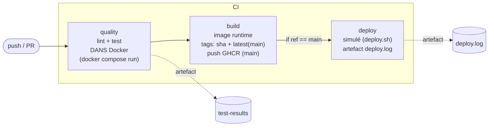

# SkillHub API — Chaîne CI/CD (EC06)

Mini API Express (Node.js 20) exposant `GET /health`, industrialisée avec
**Git + Docker + GitHub Actions**. Le code applicatif n'a pas été modifié :
l'épreuve porte sur la chaîne de livraison mise autour.

[](https://github.com/Elie1501/EC06_app/actions/workflows/ci.yml)


---

## Démarrage rapide (local)

```bash
cp .env.dist .env          # crée le .env local (non versionné)
docker compose up          # démarre l'app + PostgreSQL
curl http://localhost:3000/health   # -> {"status":"ok","service":"skillhub-api"}
```

Scripts npm (dans le conteneur ou en local) : `npm start`, `npm test`, `npm run lint`.

---

# Rapport

## 1. Workflow Git et Docker

### Stratégie de branches — **GitFlow simplifié**

| Branche        | Rôle                                                        |
|----------------|-------------------------------------------------------------|
| `main`         | Production. **Protégée**. Reçoit uniquement des merges via PR. |
| `develop`      | Intégration continue des fonctionnalités.                   |
| `feature/<nom>`| Travaux éphémères (ex. `feature/dockerfile`, `feature/ci-pipeline`), fusionnés dans `develop` via Pull Request. |

*Justification* : GitFlow simplifié sépare clairement le code stable
(`main`) du code en cours d'intégration (`develop`), tout en gardant des
branches `feature/*` courtes. La CI se déclenche sur **chaque push** (toutes
branches), donc le statut est visible directement dans la PR.

**Protection de `main`** (configurée dans les *Branch protection rules* GitHub,
cf. captures dans `docs/captures-ci/`) :
- interdiction de push direct → merge par PR uniquement,
- statut CI (`quality`) requis avant merge,
- au moins 1 PR fusionnée pendant l'épreuve.

### Dockerfile — multistage

Trois stages (voir `Dockerfile`) :
1. **builder** (`node:20-alpine`) : installe **toutes** les dépendances
   (dev incluses) → base reproductible pour lint + test dans la CI.
2. **prod-deps** : installe uniquement les dépendances de production
   (`npm ci --omit=dev`).
3. **runtime** (image finale) : `node:20-alpine`, ne copie que
   `node_modules` de prod + `src`, tourne en **utilisateur non-root**
   (`USER node`), déclare `EXPOSE 3000` et un `HEALTHCHECK` qui interroge
   `/health`. Image finale **légère (< 200 Mo)**.

### docker-compose

`docker compose up` démarre deux services :
- **app** : construit sur le stage `builder`, chargé via `env_file: .env`.
- **db** : `postgres:16-alpine`, avec un **volume** `pgdata` pour la
  persistance et un `healthcheck` (`pg_isready`). L'app attend que la base
  soit saine (`depends_on: condition: service_healthy`).

Le `.env` est **ignoré par Git** ; seul `.env.dist` (placeholders, sans
secret réel) est versionné.

## 2. Architecture du pipeline CI/CD

Workflow `.github/workflows/ci.yml`, déclenché sur **chaque push** (+ bonus
`pull_request` vers `main`/`develop`).



| Job       | Déclencheur        | Rôle                                                                 |
|-----------|--------------------|----------------------------------------------------------------------|
| `quality` | tout push / PR     | `cp .env.dist .env`, puis `docker compose run --rm app npm run lint` et `npm test`. Publie l'artefact `test-results`. Cache npm activé. |
| `build`   | après `quality`    | Construit l'image **runtime** (`docker/build-push-action`, target `runtime`). Tags : sha court partout + `latest` sur `main`. Push vers **GHCR** uniquement sur `main`. Cache de build GHA. |
| `deploy`  | `main` uniquement  | Exécute `deploy.sh` (simulé), produit et publie `deploy.log` comme artefact. Utilise l'environnement GitHub `production`. |

## 3. Gestion des secrets

| Secret               | Où il est défini            | Usage                                    |
|----------------------|-----------------------------|------------------------------------------|
| `GITHUB_TOKEN`       | Fourni automatiquement      | Auth `ghcr.io` pour push d'image (main). |
| `DEPLOY_HOST`        | GitHub → Settings → Secrets | Cible du déploiement (job `deploy`).     |
| `DEPLOY_USER`        | GitHub → Settings → Secrets | Utilisateur de déploiement.              |

Principes appliqués :
- **Aucun secret en clair** dans `ci.yml`, le code ou les logs — tout passe
  par `${{ secrets.* }}`.
- **`.env` jamais versionné** (présent dans `.gitignore`) ; seul `.env.dist`
  avec des **placeholders** est commité. La CI recrée le `.env` via
  `cp .env.dist .env`.
- Permissions **granulaires** sur le `GITHUB_TOKEN` (`contents: read` par
  défaut, `packages: write` uniquement pour le job `build`).
- `latest` et le push GHCR sont limités à `main` (pas de fuite d'image
  intermédiaire depuis les branches de feature).

## 4. Instructions et limites

**Cloner et lancer en local :**
```bash
git clone <url-du-depot>
cd EC06_app
cp .env.dist .env
docker compose up          # app sur http://localhost:3000
docker compose run --rm app npm test    # lint/test comme en CI
```

**Fait / non fait :**
- ✅ Piliers 1-2-3 complets : Git + GitFlow, Dockerfile multistage non-root,
  compose app+DB, pipeline `quality → build → deploy` vert sur push.
- ✅ Bonus réalisés : push GHCR + tags cohérents, cache npm + cache de build
  GHA, trigger `pull_request`, artefacts (tests + deploy.log), badges.

**Améliorations futures envisageables :**
- Scan d'image (Trivy / Grype / Docker Scout) en amont du push.
- Image finale **distroless** pour réduire encore la surface d'attaque.
- Déploiement réel (SSH sur VM ou PaaS gratuit) via GitHub Environments +
  approbation manuelle.
- Matrice de build multi-versions de Node, releases automatisées (tags).
